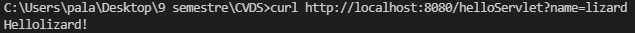

# LABORATORIO 5 - MVC PRIMEFACES INTRODUCTION

## ESCUELA COLOMBIANA DE INGENIERÍA
## INTRODUCCIÓN A PROYECTOS WEB
### PARTE I. - JUGANDO A SER UN CLIENTE HTTP
1. Abra una terminal Linux o consola de comandos Windows.
2. Realice una conexión síncrona TCP/IP a través de Telnet/Netcat al siguiente servidor:
    - Host: www.escuelaing.edu.co
    - Puerto: 80
    Teniendo en cuenta los parámetros del comando telnet:
    telnet HOST PORT
3. Antes de que el servidor cierre la conexión por falta de comunicación:
    - Revise la página 36 del RFC del protocolo HTTP, sobre cómo realizar una petición GET. Con esto, solicite al servidor el recurso ‘sssss/abc.html’, usando la versión 1.0 de HTTP.  
    Para esto usaremos 
    <pre>GET /sssss/abc.html HTTP/1.0</pre> 
    seguido de
    <pre>Host: escuelaing.edu.co</pre> 
    - Asegúrese de presionar ENTER dos veces después de ingresar el comando.
    - Revise el resultado obtenido. ¿Qué codigo de error sale?, revise el significado del mismo en la lista de códigos de estado HTTP.
    
    301 Moved Permanently: Esta y todas las solicitudes futuras deben dirigirse al URI dada.
    - ¿Qué otros códigos de error existen?, ¿En qué caso se manejarán?
        1. 1xx informational response – la solicitud fue recibida, proceso continuo
        2. 2xx successful – la solicitud fue recibida, comprendida y aceptada con éxito
        3. 3xx redirection – Se deben tomar más medidas para completar la solicitud.
        4. 4xx client error –la solicitud contiene una sintaxis incorrecta o no se puede cumplir
        5. 5xx server error –el servidor no cumplió con una solicitud aparentemente válida
4. Realice una nueva conexión con telnet, esta vez a:
    - Host: www.httpbin.org
    - Puerto: 80
    - Versión HTTP: 1.1
    Ahora, solicite (GET) el recurso /html. ¿Qué se obtiene como resultado?

    

¡Muy bien!, ¡Acaba de usar del protocolo HTTP sin un navegador Web!. Cada vez que se usa un navegador, éste se conecta a un servidor HTTP, envía peticiones (del protocolo HTTP), espera el resultado de las mismas, y -si se trata de contenido HTML- lo interpreta y dibuja.

5. Seleccione el contenido HTML de la respuesta y copielo al cortapapeles CTRL-SHIFT-C. Ejecute el comando wc (word count) para contar palabras con la opción -c para contar el número de caracteres:

    <pre>wc -c</pre>

    Pegue el contenido del portapapeles con CTRL-SHIFT-V y presione CTRL-D (fin de archivo de Linux). Si no termina el comando wc presione CTRL-D de nuevo. No presione mas de dos veces CTRL-D indica que se termino la entrada y puede cerrarle la terminal. Debe salir el resultado de la cantidad de caracteres que tiene el contenido HTML que respondió el servidor.

    

    Claro está, las peticiones GET son insuficientes en muchos casos. Investigue: ¿Cuál es la diferencia entre los verbos GET y POST? ¿Qué otros tipos de peticiones existen?
    1. En el tipo de petición GET los parámetros URL se guardan junto al URL mientras que con POST no. Por lo que POST ofrece mayor discreción debido a que tampoco se guardan los parámetros URL en el caché ni en el registro del servidor caso contrario en GET que se guardan sin cifrar.
    2. - OPTIONS
        - HEAD solo revisa los headers
        - PUT deposita en la ubicación de destino
        - DELETE elimina en la ubicación de destino
        - CONNECT
        - TRACE

6. En la practica no se utiliza telnet para hacer peticiones a sitios web sino el comando curl con ayuda de la linea de comandos:

    <pre>curl www.httpbin.org</pre>
    
    Utilice ahora el parámetro -v y con el parámetro -i:
    <pre> curl -v www.httpbin.org</pre>
    
    <pre>curl -i www.httpbin.org</pre>
    

¿Cuáles son las diferencias con los diferentes parámetros?  
- curl -v Make the operation more talkative

- curl -i Include protocol response headers in the output

- como se ve en la imágenes el i incluye todo el protocolo de respuesta la v hacia una mayor descripción de todo lo que pasa

### PARTE II. - HACIENDO UNA APLICACIÓN WEB DINÁMICA A BAJO NIVEL.
En este ejercicio, va a implementar una aplicación Web muy básica, haciendo uso de los elementos de más bajo nivel de Java-EE (Enterprise Edition), con el fin de revisar los conceptos del protocolo HTTP. En este caso, se trata de un módulo de consulta de clientes Web que hace uso de una librería de acceso a datos disponible en un repositorio Maven local.

I. Para esto, cree un proyecto maven nuevo usando el arquetipo de aplicación Web estándar maven-archetype-webapp 

y realice lo siguiente:

1. Revise la clase SampleServlet incluida a continuacion, e identifique qué hace:

<pre>
package edu.eci.cvds.servlet;

import java.io.IOException;
import java.io.Writer;
import java.util.Optional;
import javax.servlet.ServletException;
import javax.servlet.annotation.WebServlet;
import javax.servlet.http.HttpServlet;
import javax.servlet.http.HttpServletRequest;
import javax.servlet.http.HttpServletResponse;

@WebServlet(
    urlPatterns = "/helloServlet"
)
public class SampleServlet extends HttpServlet{
    static final long serialVersionUID = 35L;

    @Override
   protected void doGet(HttpServletRequest req, HttpServletResponse resp) throws ServletException, IOException {
       Writer responseWriter = resp.getWriter();
       Optional<String> optName = Optional.ofNullable(req.getParameter("name"));
       String name = optName.isPresent() && !optName.get().isEmpty() ? optName.get() : "";

       resp.setStatus(HttpServletResponse.SC_OK);
       responseWriter.write("Hello" + name + "!");
       responseWriter.flush();
   }
}
</pre>
Revise qué valor tiene el parámetro ‘urlPatterns’ de la anotación @WebServlet, pues este indica qué URLs atiende las peticiones el servlet.

La clase Sample Servlet extiende de una clase que se va a encargar de el protocolo http y esta clase servlet esta sobreescribiendo el método de doGet que se encarga de lo que es el GET del protocolo HTTP. la variable urlPatterns es la que va a almacenar la ruta URL para usar el protocolo http

2. En el pom.xml, modifique la propiedad "packaging" con el valor "war". Agregue la siguiente dependencia:
    ~~~
    <dependency>
        <groupId>javax</groupId>
        <artifactId>javaee-web-api</artifactId>
        <version>7.0</version>
        <scope>provided</scope>
    </dependency>
y agregue la seccion build al final del tag project en el archivo pom.xml:  
    
    <build>
    <plugins>
        <plugin>
            <groupId>org.apache.maven.plugins</groupId>
            <artifactId>maven-compiler-plugin</artifactId>
            <version>3.8.0</version>
            <configuration>
                <source>1.8</source>
                <target>1.8</target>
            </configuration>
        </plugin>
        <plugin>
            <groupId>org.apache.maven.plugins</groupId>
            <artifactId>maven-war-plugin</artifactId>
            <version>2.3</version>
            <configuration>
                <failOnMissingWebXml>false</failOnMissingWebXml>
            </configuration>
        </plugin>
        <plugin>
            <groupId>org.apache.maven.plugins</groupId>
            <artifactId>maven-dependency-plugin</artifactId>
            <version>2.6</version>
            <executions>
                <execution>
                    <phase>validate</phase>
                    <goals>
                        <goal>copy</goal>
                    </goals>
                    <configuration>
                        <silent>true</silent>
                        <artifactItems>
                            <artifactItem>
                                <groupId>javax</groupId>
                                <artifactId>javaee-endorsed-api</artifactId>
                                <version>7.0</version>
                                <type>jar</type>
                            </artifactItem>
                        </artifactItems>
                    </configuration>
                </execution>
            </executions>
        </plugin>

        <!-- Tomcat embedded plugin. -->
        <plugin>
            <groupId>org.apache.tomcat.maven</groupId>
            <artifactId>tomcat7-maven-plugin</artifactId>
            <version>2.2</version>
            <configuration>
                <port>8080</port>
                <path>/</path>
            </configuration>
        </plugin>
    </plugins>
    </build>
3. Revise en el pom.xml para qué puerto TCP/IP está configurado el servidor embebido de Tomcat (ver sección de plugins).

4. Compile y ejecute la aplicación en el servidor embebido Tomcat, a través de Maven con:
    <pre>
    mvn package
    mvn tomcat7:run
    </pre>

    
      

5. Abra un navegador, y en la barra de direcciones ponga la URL con la cual se le enviarán peticiones al ‘SampleServlet’. Tenga en cuenta que la URL tendrá como host ‘localhost’, como puerto, el configurado en el pom.xml y el path debe ser el del Servlet. Debería obtener un mensaje de saludo.  

    
    

6. Observe que el Servlet ‘SampleServlet’ acepta peticiones GET, y opcionalmente, lee el parámetro ‘name’. Ingrese la misma URL, pero ahora agregando un parámetro GET (si no sabe como hacerlo, revise la documentación en http://www.w3schools.com/tags/ref_httpmethods.asp).  
  
    
    

7. Busque el artefacto gson en el repositorio de maven y agregue la dependencia.

    

8. En el navegador revise la dirección https://jsonplaceholder.typicode.com/todos/1. Intente cambiando diferentes números al final del path de la url.

    
    
    
 
9. Basado en la respuesta que le da el servicio del punto anterior, cree la clase edu.eci.cvds.servlet.model.Todo con un constructor vacío y los métodos getter y setter para las propiedades de los "To Dos" que se encuentran en la url indicada.

10. Utilice la siguiente clase para consumir el servicio que se encuentra en la dirección url del punto anterior:

<pre>
package edu.eci.cvds.servlet;

import java.io.BufferedReader;
import java.io.IOException;
import java.io.InputStreamReader;
import java.net.MalformedURLException;
import java.net.URL;
import java.net.URLConnection;
import java.util.List;

import com.google.gson.Gson;

import edu.eci.cvds.servlet.model.Todo;

public class Service {

   public static Todo getTodo(int id) throws MalformedURLException, IOException {
       URL urldemo = new URL("https://jsonplaceholder.typicode.com/todos/" + id);
       URLConnection yc = urldemo.openConnection();
       BufferedReader in = new BufferedReader(new InputStreamReader(yc.getInputStream()));
       Gson gson = new Gson();
       Todo todo = gson.fromJson(in, Todo.class);
       in.close();
       return todo;
   }

   private static String todoToHTMLRow(Todo todo) {
       return new StringBuilder("<tr>")
           .append("<td>")
           .append(todo.getUserId())
           .append("</td><td>")
           .append(todo.getId())
           .append("</td><td>")
           .append(todo.getTitle())
           .append("</td><td>")
           .append(todo.getCompleted())
           .append("</td>")
           .append("</tr>")
           .toString();
   }

   public static String todosToHTMLTable(List<Todo> todoList) {
       StringBuilder stringBuilder = new StringBuilder("<table>")
           .append("<tr>")
           .append("<th>User Id</th>")
           .append("<th>Id</th>")
           .append("<th>Title</th>")
           .append("<th>Completed</th>")
           .append("</tr>");

       for (Todo todo : todoList) {
           stringBuilder.append(todoToHTMLRow(todo));
       }

       return stringBuilder.append("</table>").toString();
   }
}
</pre>
11. Cree una clase que herede de la clase HttpServlet (similar a SampleServlet), y para la misma sobrescriba el método heredado doGet. Incluya la anotación @Override para verificar –en tiempo de compilación- que efectivamente se esté sobreescribiendo un método de las superclases.

12. Para indicar en qué URL el servlet interceptará las peticiones GET, agregue al método la anotación @WebServlet, y en dicha anotación, defina la propiedad urlPatterns, indicando la URL (que usted defina) a la cual se asociará el servlet.

13. Teniendo en cuenta las siguientes métodos disponibles en los objetos ServletRequest y ServletResponse recibidos por el método doGet:

    - response.setStatus(N); <- Indica con qué código de error N se generará la respuesta. Usar la clase HttpServletResponse para indicar el código de respuesta.
    - request.getParameter(param); <- Consulta el parámetro recibido, asociado al nombre ‘param’.
    - response.getWriter() <- Retorna un objeto PrintWriter a través del cual se le puede enviar la respuesta a quien hizo la petición.
    - response.setContentType(T) <- Asigna el tipo de contenido (MIME type) que se entregará en la respuesta.
    - Implemente dicho método de manera que:

        - Asuma que la petición HTTP recibe como parámetro el número de id de una lista de cosas por hacer (todo), y que dicha identificación es un número entero.

        - Con el identificador recibido, consulte el item por hacer de la lista de cosas por hacer, usando la clase "Service" creada en el punto 10.

        - Si el item existe:
            - Responder con el código HTTP que equivale a ‘OK’ (ver referencia anterior), y como contenido de dicha respuesta, el código html correspondiente a una página con una tabla que tenga los detalles del item, usando la clase "Service" creada en el punto 10 par crear la tabla.  

        

        - Si el item no existe:
            - Responder con el código correspondiente a ‘no encontrado’, y con el código de una página html que indique que no existe un item con el identificador dado.
            - Si no se paso parámetro opcional, o si el parámetro no contiene un número entero, devolver el código equivalente a requerimiento inválido.
            - Si se genera la excepcion MalformedURLException devolver el código de error interno en el servidor
            - Para cualquier otra excepcion, devolver el código equivalente a requerimiento inválido.  

        
        
        
14. Una vez hecho esto, verifique el funcionamiento de la aplicación, recompile y ejecute la aplicación.

15. Intente hacer diferentes consultas desde un navegador Web para probar las diferentes funcionalidades.